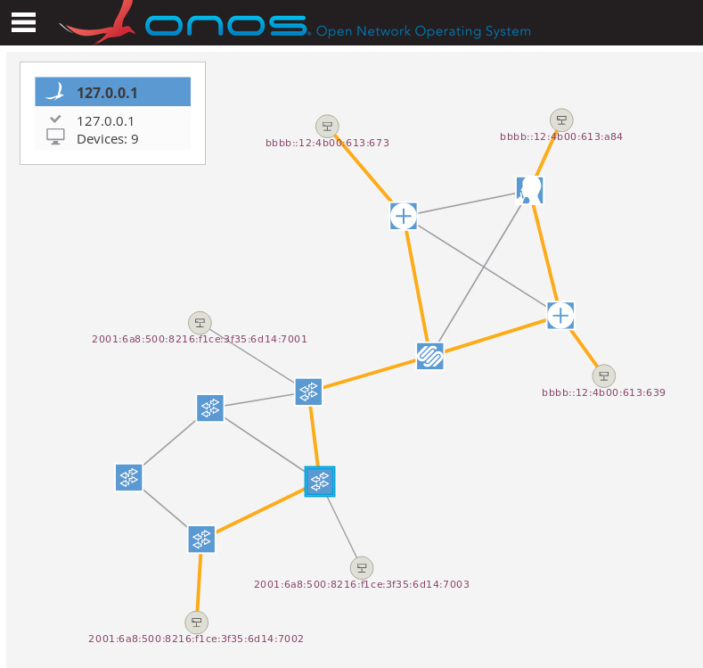
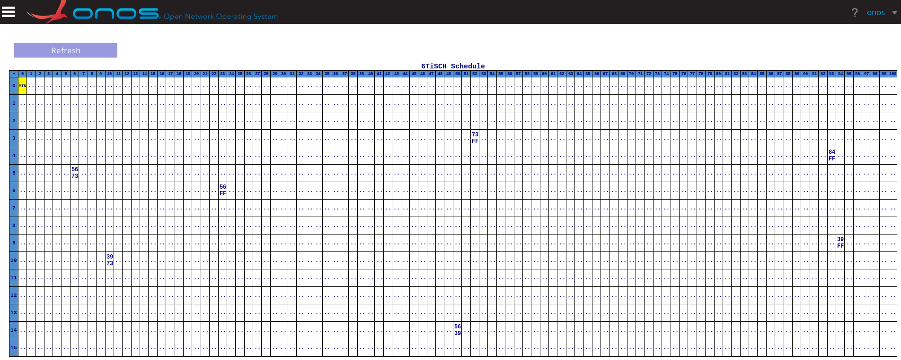
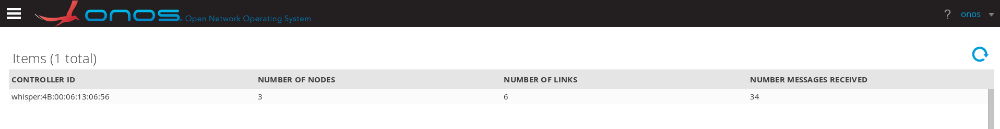

# Whisper-repository

Collection of software for using Whisper in a 6TiSCH network

## Publications

Municio, Esteban, Johann Marquez-Barja, Steven Latré, and Stefano Vissicchio. "Whisper: Programmable and flexible control on industrial IoT networks." Sensors 18, no. 11 (2018): 4048.

Municio, Esteban, Steven Latre, and Johann M. Marquez-Barja. "Extending Network Programmability to the Things Overlay using Distributed Industrial IoT Protocols." IEEE Transactions on Industrial Informatics 17, no. 1 (2020): 251-259.

Municio, Esteban, Niels Balemans, Steven Latré, and Johann Marquez-Barjal. "Leveraging distributed protocols for full end-to-end softwarization in iot networks." In 2020 IEEE 17th Annual Consumer Communications & Networking Conference (CCNC), pp. 1-6. IEEE, 2020.

## Contains
---
This repository includes:

1. The Whisper controller
    - Algorithms for translating Policies to Primitives.
    - Local Whisper Controller that runs in Openvisualizer.
    - Coap repository.
    - Sample topologies to test the switch-parent algorithm.
    - Misc tools.
2. Current OpenWSN firmware:
	- Current original OpenWSN firmware for the normal nodes (updated 10 Dec 2019).
3. Firmware for the Whisper nodes (root and leaf):
	- Modified version of OpenWSN that comunicates with the controller through COAP (leaf) and through serial (root).
5. Monitoring tools:
 	- A sniffer for OpenMote that captures traffic from the network.
	- A modified version of Foren6 to process and display information from the captured traffic:
 		- Parent relationship (DAOs).
		- Ranks (DIOs).
 		- 6TiSCH schedules (6P commands).
6. ONOS framework with including the Whisper module:
    - Whisper provider.
    - Whisper protocol (southband).
    - Whisper App (GUI+CLI)
        - 6TiSCH Topology Component
        - 6TiSCH schedules UI Component
        - Whisper Controllers UI Table Components

## Supports:
---
* Parent switching through DIOs
* Schedule modification through 6P commands (e.g. to allocate cells before the parent switch or 6P List)
* Monitoring capabilities:
    - Neighbors of the Whisper node
    - Logic and physical topology
* Orchestration from ONOS via edge metrics and intents.

## Examples:
---

Augmented Topology

6TiSCH Schedules

Whisper Controllers View

Questions, issues and bugs
---------------

Report to:

* esteban.municio@uantwerpen.be
* niels.balemans@uantwerpen.be

